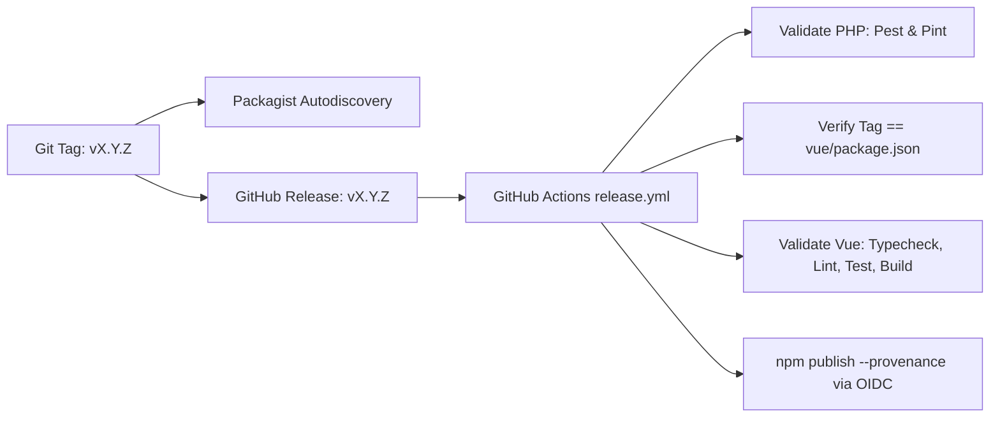

# Release Guide

This document outlines the dual-release architecture and release procedure for Zonvoir Table.

- **PHP / Laravel Package**: `zonvoir/laravel-inertia-table` (published to [Packagist](https://packagist.org/packages/zonvoir/laravel-inertia-table) from the repository root via Git tags).
- **Vue Adapter**: `@zonvoir/inertia-table-vue` (published to [npm](https://www.npmjs.com/package/@zonvoir/inertia-table-vue) from `vue/` with provenance via GitHub Actions OIDC).
- **Future Adapters**: Designed to accommodate future frontend adapters (e.g. `@zonvoir/inertia-table-react`, `@zonvoir/inertia-table-svelte`) following the same adapter pattern.

Both artifacts are released in unison using synchronized semantic versioning (e.g., Git tag `v0.1.0` and npm version `0.1.0`).

---

## Architecture Overview



1. **Composer / Packagist**: Discovers releases automatically whenever a Git tag is created. Versions are derived directly from the tag name (e.g., `v0.1.0` -> `0.1.0`). There is no separate Composer upload command or token.
2. **npm**: Published by GitHub Actions using **Trusted Publishing (OIDC)**. No permanent `NODE_AUTH_TOKEN` or npm secret is stored in the repository.
3. **Version Synchronization**: The `scripts/verify-release-version.mjs` script enforces that the release tag exactly matches the version declared in `vue/package.json` and `vue/package-lock.json`.

---

## One-Time External Setup

### 1. Packagist Configuration
1. Sign in to [Packagist](https://packagist.org) with the authorized maintainer GitHub account.
2. Submit the repository URL: `https://github.com/Zonvoir-technologies/laravel-inertia-table`.
3. Enable GitHub service integration or configure the webhook under **Settings > Webhooks** on GitHub to enable instant synchronization when tags are pushed.
4. Verify that Packagist lists `zonvoir/laravel-inertia-table`.

### 2. npm Trusted Publishing Setup
npm Trusted Publishing uses short-lived OpenID Connect (OIDC) tokens issued by GitHub Actions, eliminating long-lived npm tokens.

1. Ensure maintainers have access to the `@zonvoir` organization/scope on [npmjs.com](https://www.npmjs.com).
2. Ensure two-factor authentication (2FA) is enforced for maintainers.
3. If `@zonvoir/inertia-table-vue` is being published for the first time:
   - Run a clean build and verification locally:
     ```bash
     cd vue
     npm ci
     npm run typecheck && npm run lint && npm run test && npm run build
     npm pack --dry-run
     ```
   - Perform the initial publish manually using an authorized maintainer session:
     ```bash
     npm publish --access public
     ```
4. Once the package exists on npm:
   - Open package settings at `https://www.npmjs.com/package/@zonvoir/inertia-table-vue/access`.
   - Scroll to **Trusted Publishers** and click **Add Trusted Publisher**.
   - Select **GitHub Actions**.
   - Configure:
     - **Organization / User**: `Zonvoir-technologies`
     - **Repository**: `laravel-inertia-table`
     - **Workflow filename**: `release.yml`
   - Save and ensure direct publishing is permitted.
5. Confirm zero npm tokens or secrets are stored in GitHub repository secrets.

---

## Maintainer Release Procedure

Follow these steps for every new release:

### Step 1: Pull the latest default branch
Ensure your local working copy is clean and on the latest `main` commit:
```bash
git checkout main
git pull origin main
git status
```

### Step 2: Bump version in Vue package
Determine the next semantic version according to [SemVer 2.0.0](https://semver.org) (e.g. `0.1.0` or `1.0.0`).

Update `vue/package.json`:
```json
{
  "name": "@zonvoir/inertia-table-vue",
  "version": "X.Y.Z"
}
```

Synchronize `vue/package-lock.json`:
```bash
cd vue
npm install --package-lock-only
cd ..
```

### Step 3: Update CHANGELOG.md
Document all additions, changes, and fixes under the new release header following [Keep a Changelog](https://keepachangelog.com/).

### Step 4: Run local verification gates
Execute all quality gates locally:

```bash
# 1. PHP package validation
composer validate --strict
composer lint
composer test

# 2. Vue adapter validation
cd vue
npm run typecheck
npm run lint
npm test
npm run build
npm pack --dry-run
cd ..

# 3. Release version alignment check
node scripts/verify-release-version.mjs vX.Y.Z
```

Verify that `npm pack --dry-run` includes all required distribution files (`dist/zonvoir-table.js`, `dist/zonvoir-table.cjs`, `dist/index.d.ts`, `LICENSE`, `README.md`) and no internal test files or source maps.

### Step 5: Open a Release PR
Commit the release preparation files to a branch:
```bash
git checkout -b release/vX.Y.Z
git add vue/package.json vue/package-lock.json CHANGELOG.md
git commit -m "chore(release): prepare vX.Y.Z"
git push origin release/vX.Y.Z
```
Open a PR, ensure all CI checks pass, obtain review approval, and merge into `main`.

### Step 6: Create GitHub Release
1. Navigate to **Releases > Draft a new release** on GitHub.
2. Enter the new tag name: `vX.Y.Z` (matching the version in `vue/package.json`).
3. Set Target to the merged commit on `main`.
4. Set Release Title: `vX.Y.Z`.
5. Paste the release notes from `CHANGELOG.md`.
6. Click **Publish release**.

### Step 7: Automated Publication
1. GitHub Actions will trigger `.github/workflows/release.yml`.
2. The workflow checks out tag `vX.Y.Z`, runs the PHP and Vue test suites, verifies version alignment, builds the distribution, and publishes `@zonvoir/inertia-table-vue` to npm with provenance.
3. Packagist automatically synchronizes the new tag `vX.Y.Z` for `zonvoir/laravel-inertia-table`.

---

## Critical Rules & Failure Recovery

### Tag Immutability
- **Public Git tags must never be deleted, replaced, or moved.**
- Once a tag `vX.Y.Z` is published or pushed, it is permanent. Moving tags causes cache divergence on Packagist, Go proxy, npm, and consumer lockfiles.

### What if npm publishing fails?
- **Workflow / network issue**: If the release workflow fails due to an ephemeral network error or GitHub Actions issue (and no code change is required), re-run the failed job from the GitHub Actions UI.
- **Code or packaging issue**: If the package code itself was defective, **do not** recreate the tag. Instead:
  1. Fix the bug in a new commit.
  2. Bump the version to the next patch (e.g. `vX.Y.(Z+1)`).
  3. Create a new GitHub Release for `vX.Y.(Z+1)`.

### Atomic Releases
Packagist and npm are independent registries. While publication is coordinated, failures in one registry cannot rollback the other. For this reason, all validation, testing, and dry-run steps run **before** any publication step in `.github/workflows/release.yml`.
